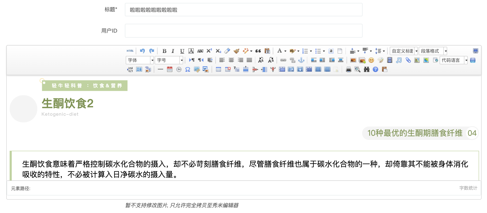

# ActiveAdmin Ueditor

An Active Admin plugin to use [Ueditor Rich Text Editor](https://github.com/fex-team/ueditor)



## Install

1. Update your Gemfile: `gem 'activeadmin_ueditor'` (and execute *bundle*)
2. Copy some ueditor assets to your public assets directory
```sh
cp -rf public/assets/ueditor your_project/public/assets/ueditor
```
3. Add at the end of `.gitignore`:
```txt
!/public/assets/ueditor
```
4. Add at the end of your ActiveAdmin javascripts (_app/assets/javascripts/active_admin.js_):
```js
//= require activeadmin/ueditor/ueditor.config
//= require activeadmin/ueditor/ueditor.all.min
```
5. Use the input with `as: :ueditor, input_html: { name: 'your_model[your_column]' }` in Active Admin model conf

## Examples

```ruby
# ActiveAdmin article form conf:
  form do |f|
    f.inputs 'Article' do
      f.input :title
      f.input :description, as: :ueditor, input_html: { name: 'article[description]' }
      f.input :published
    end
    f.actions
    script <<~JAVASCRIPT.html_safe
      var editor = new UE.ui.Editor({
        initialFrameHeight: 280
      });
      editor.render("ueditor");
    JAVASCRIPT
  end
```

## Notes

- Upload functions (Images, Documents, Files, etc.) are not implemented yet, you can impletment the endpoint `get /assets/ueditor/upload_ueditor`.

## Do you like it? Star it!

If you use this component just star it. A developer is more motivated to improve a project when there is some interest.

Take a look at [other interesting projects](https://github.com/shootingfly?tab=repositories) that I made if you are curious.

## Contributors

- [Shootingfly](https://github.com/shootingfly) - creator, maintainer

## License

[MIT](LICENSE.txt)
